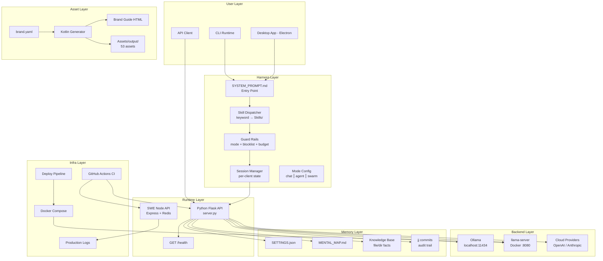
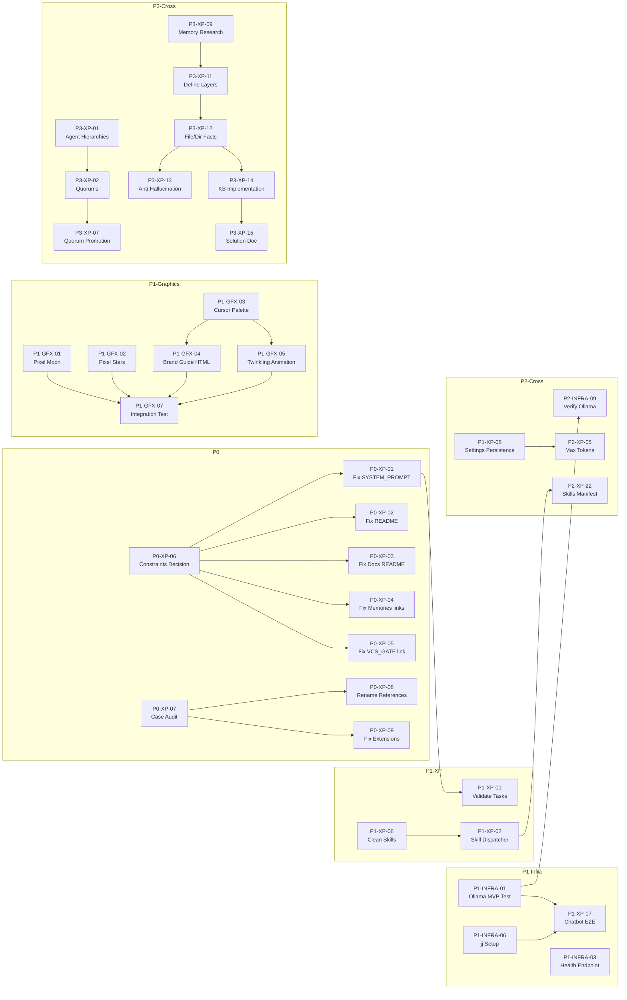

# Consolidated Team PRD — dotAi / Mystic / Aura

## 1. Executive Summary

### Vision

dotAi (publicly branded **Aura**, assets branded **Mystic**) is a declarative, markdown-first AI agent orchestration system. No protocol servers — files are the protocol, jj commits are the communication bus. The system provides a local-first AI coding harness backed by Ollama / llama-server with GGUF models, extensible to cloud providers.

### Current state

**7 of 113** original todos are completed (6 scaffold/bootstrap items from MVP_PRD + 1 branch cleanup). The repository has ~40 broken internal links from incomplete structural migrations, no CI coverage for the Python harness, and the runtime lacks skill dispatch, session isolation, and mode enforcement. The Mystic pixel art generator is functional but needs a visual rebrand to pixel art style with Cursor's color palette.

### What ships and when

| Milestone | Gate | Target |
|-----------|------|--------|
| **Iteration 0** (P0) | All broken paths fixed, Redis client fixed, repo navigable | Week 1 |
| **Iteration 1** (P1-MVP) | Ollama works locally, skill dispatcher, session isolation, mode enforcement, harness in CI, jj initialized | Weeks 2–3 |
| **Iteration 1b** (P1-Brand) | Pixel art moon/stars, Cursor palette, brand guide HTML, twinkling animation, all 45 tests pass | Weeks 2–3 |
| **Iteration 2** (P2) | Settings polish, hotkeys, human verification, README rewrite, deploy docs, schema validation | Weeks 4–6 |
| **Iteration 3** (P3) | Agent governance, memory system, knowledge base, version tag | Weeks 7–10 |

### Priority tiers

| Tier | Meaning | Count |
|------|---------|-------|
| **P0** | Blocks everything — broken paths, data corruption | 10 |
| **P1** | MVP gate — system must be runnable | 38 |
| **P2** | Polish — settings, hotkeys, verification, README, docs | 48 |
| **P3** | Strategic — agent governance, layered memory, KB | 16 |
| **Completed** | Carried forward | 7 |
| **Total** | | **119** |

### Team distribution

| Team | Items |
|------|-------|
| **XP Engineers** | 80 |
| **Graphics & Brand** | 12 |
| **Infrastructure** | 27 |

---

## 2. Architecture Overview

### System diagram

### Component → Team mapping

| Component | Owner | Support |
|-----------|-------|---------|
| Harness (Python Flask) | XP | Infra (CI) |
| Skill Dispatcher | XP | — |
| Guard Rails & Mode Enforcement | XP | — |
| Session Manager | XP | — |
| Settings & Config | XP | — |
| SWE Node API | Infra | XP (tests) |
| Ollama / llama-server | Infra | XP (config) |
| Docker Compose | Infra | — |
| CI/CD Pipelines | Infra | — |
| Deploy & Production Branch | Infra | — |
| Redis | Infra | — |
| Health Endpoints | Infra | XP (contract) |
| Pixel Art Generator (Kotlin) | Graphics | — |
| Brand Guide HTML | Graphics | — |
| Color Palette & Typography | Graphics | — |
| README Visual Polish | Graphics | XP (content) |
| Repo Path Consistency | XP | — |
| Memory System & KB | XP | — |
| Agent Governance | XP | — |
| jj Integration | Infra | XP (conventions) |

---

## 3. XP Engineering Track

### 3.1 P0 — Critical Fixes

These items block all other work. Broken paths prevent agents from navigating the system.

| ID | Description | Acceptance Criteria | Source PRD | Depends-On |
|----|-------------|-------------------|------------|------------|
| P0-XP-01 | Fix all broken paths in SYSTEM_PROMPT.md | Every link in SYSTEM_PROMPT.md resolves to an existing file; `grep -r 'Project/Product' Orchestration/Harness/SYSTEM_PROMPT.md` returns 0 hits | REPO_CONSISTENCY_PRD | P0-XP-06 |
| P0-XP-02 | Fix root README.md broken references | No references to `Project/`, `Orchestration/Constraints/`, or `START_HERE.md` in README.md | REPO_CONSISTENCY_PRD | P0-XP-06 |
| P0-XP-03 | Fix Documents/README.md paths | All `Project/Product/` references updated; SYSTEM_PROMPT.md link resolves | REPO_CONSISTENCY_PRD | P0-XP-06 |
| P0-XP-04 | Fix Memories/Constraints.md relative links | VCS_AND_FILE_GATE.md and JJ.md links resolve from Constraints.md location | REPO_CONSISTENCY_PRD | P0-XP-06 |
| P0-XP-05 | Fix VCS_AND_FILE_GATE.md relative link | USER_VCS_SCORING.md link resolves correctly | REPO_CONSISTENCY_PRD | P0-XP-06 |
| P0-XP-06 | Decide Constraints location | Decision documented; chosen path used consistently in all fixes | REPO_CONSISTENCY_PRD | — |
| P0-XP-07 | Case-sensitivity audit | `find . -path ./.git -prune -o -print` on Linux shows no duplicate paths differing only by case | MVP_PRD, REPO_CONSISTENCY_PRD | — |
| P0-XP-08 | Rename References/ to lowercase | `ls -la` shows lowercase `references/`; no broken imports | MVP_PRD | P0-XP-07 |
| P0-XP-09 | Fix Extensions casing | `Extensions/Huggingface/` and `Extensions/Openai/` match link references; verified on Linux | REPO_CONSISTENCY_PRD | P0-XP-07 |

### 3.2 P1 — MVP Runtime

Core runtime features that must work for the MVP acceptance test to pass.

| ID | Description | Acceptance Criteria | Source PRD | Depends-On |
|----|-------------|-------------------|------------|------------|
| P1-XP-01 | Validate all task files | Every file in Orchestration/Tasks/ has substantive content (>20 lines or clear purpose); zero stubs | MVP_PRD | P0-XP-01 |
| P1-XP-02 | Skill dispatcher MVP | `generate` and `summarize` keywords are intercepted before LLM call; SKILL.md injected into context; non-matching input passes through unchanged | MVP_PRD, CODE_REVIEW_PRD | P1-XP-06 |
| P1-XP-03 | Session-keyed conversations | Two concurrent HTTP clients have isolated conversation histories; session_id passed in /api/chat; no shared global state | MVP_PRD, CODE_REVIEW_PRD | — |
| P1-XP-04 | Harness mode config | `mode` field exists in SETTINGS.json (chat/agent/swarm); config.py reads it; chat mode blocks file-write tool calls | MVP_PRD, CODE_REVIEW_PRD, FEATURES_PRD | — |
| P1-XP-05 | Guard rails enforcement | guard_rails.py checks mode constraints, skill constraints, and budget (max_actions_before_pivot); length-only checks upgraded | CODE_REVIEW_PRD | P1-XP-04 |
| P1-XP-06 | Clean up empty skill dirs | Each Skills/ subdirectory either has a SKILL.md or is deleted; dispatcher finds zero empty matches | CODE_REVIEW_PRD | — |
| P1-XP-07 | Chatbot end-to-end test | An AI agent reads START_HERE.md, navigates to a task, performs a simple edit, and commits via jj; test report documents successes and failures | MVP_PRD | P1-INFRA-01, P1-INFRA-06 |
| P1-XP-08 | Settings persistence | UI settings stored in defined location; merge/override with SETTINGS.json documented; round-trip test passes | FEATURES_PRD | — |
| P1-XP-09 | Backend URL config | Ollama base URL is user-configurable; default `http://localhost:11434`; harness connects to custom URL when set | FEATURES_PRD | — |
| P1-XP-10 | Confirm before destructive actions | Shell exec, commit, and file delete/move require user confirmation when execution level is "restricted" | FEATURES_PRD | P1-XP-04 |
| P1-XP-11 | Command blocklists | Blocklist file exists in memories/; harness loads it at startup; blocked commands return error or require confirmation | FEATURES_PRD, MVP_PRD | — |
| P1-XP-12 | Remove all START_HERE.md references | `grep -r 'START_HERE.md'` across repo returns 0 hits (excluding this PRD and historical notes) | REPO_CONSISTENCY_PRD | P0-XP-01 |
| P1-XP-13 | Fix Harness/README.md paths | All links resolve; no `Orchestration/Constraints/` or `Project/Product/` references | REPO_CONSISTENCY_PRD | P0-XP-06 |
| P1-XP-14 | Fix CHATBOT.md paths | VCS_AND_FILE_GATE link resolves | REPO_CONSISTENCY_PRD | P0-XP-06 |
| P1-XP-15 | Fix USER_VCS_SCORING.md paths | VCS_AND_FILE_GATE link resolves | REPO_CONSISTENCY_PRD | P0-XP-06 |
| P1-XP-16 | Fix CONTRIBUTING.md paths | Constraints references and GitHub URL updated | REPO_CONSISTENCY_PRD | P0-XP-06 |
| P1-XP-17 | Fix Tasks/README.md paths | SYSTEM_PROMPT.md reference corrected | REPO_CONSISTENCY_PRD | P0-XP-01 |
| P1-XP-18 | Fix ADAPTIVE_ELICITATION link | PROTOCOL_REQUIREMENTS_ELICITATION.md link resolves | REPO_CONSISTENCY_PRD | — |
| P1-XP-19 | Fix Swarm paths | Documents/PRDs/ and Documents/Plans/ references updated; START_HERE reference removed | REPO_CONSISTENCY_PRD | P0-XP-01 |
| P1-XP-20 | Fix DEFAULTS.md paths | config/ references point to actual SETTINGS.json location | REPO_CONSISTENCY_PRD | — |
| P1-XP-21 | Fix Harness scripts | install.py no longer creates Project/; headless scripts use correct entry point; naming is consistent | REPO_CONSISTENCY_PRD | P0-XP-01 |
| P1-XP-22 | Fix MVP_PRD.md paths | No `.ai/` prefix references; START_HERE.md references replaced; project/RULES.md corrected | REPO_CONSISTENCY_PRD | P0-XP-01 |
| P1-XP-23 | Remove duplicate UX wireframe | Only `Product/Prompts/UX_WIREFRAME_AGENT_PROMPT.md` exists; root copy deleted | REPO_CONSISTENCY_PRD | — |
| P1-XP-24 | Fix Product/ internal paths | No `Project/Product/`, `Project/Orchestration/`, or `Project/Extensions/` references in Product/ files | REPO_CONSISTENCY_PRD | P0-XP-06 |
| P1-XP-25 | Verify CI paths | All `.github/workflows/` paths resolve after repo consistency fixes; CI passes | REPO_CONSISTENCY_PRD | P1-XP-13 through P1-XP-24 |

### 3.3 P2 — Features & Settings

| ID | Description | Acceptance Criteria | Source PRD | Depends-On |
|----|-------------|-------------------|------------|------------|
| P2-XP-01 | SETTINGS.json schema | JSON Schema file validates current SETTINGS.json; agents can run programmatic validation | MVP_PRD | — |
| P2-XP-02 | Agent template directory | agents/TEMPLATE/ contains AGENT.md and PERSONA.md with documented format | MVP_PRD | — |
| P2-XP-03 | System detection → runtime.md | runtime.md populated with real OS, arch, GPU, RAM; MENTAL_MAP.md has real project patterns | MVP_PRD | — |
| P2-XP-04 | Harness config from env | Blocklist path, START_HERE path, and Ollama URL overridable via env vars; documented | CODE_REVIEW_PRD | — |
| P2-XP-05 | Max output tokens setting | Setting exists in UI and config; per-persona default supported; hard cap enforced | FEATURES_PRD | P1-XP-08 |
| P2-XP-06 | Default Personality on startup | Preference persisted; last-used / fixed / ask-each-time options work | FEATURES_PRD | P1-XP-08 |
| P2-XP-07 | Local-only checkbox | Setting visible in UI; no external requests made when enabled | FEATURES_PRD | P1-XP-08 |
| P2-XP-08 | Session restore | Last session state (chats, sidebar, Personality) restored on reopen; "always fresh" option works | FEATURES_PRD | P1-XP-08 |
| P2-XP-09 | Config path override | Custom path accepted; harness loads config from specified location | FEATURES_PRD | P1-XP-08 |
| P2-XP-10 | Multi-provider endpoint config | Per-provider base URL/path configurable; tested with 2+ backends | FEATURES_PRD | P1-XP-09 |
| P2-XP-11 | API keys & secrets | Secure storage (keychain or encrypted file); never logged or committed | FEATURES_PRD | P2-XP-10 |
| P2-XP-12 | Execution level refinement | More than 2 presets; custom level definable; documented | FEATURES_PRD | P1-XP-04 |
| P2-XP-13 | Budget / rate limits | Budget tracking per-session and per-model; alerts when approaching limit | FEATURES_PRD | P2-XP-10 |
| P2-XP-14 | Self-update strategy | Auto-update mechanism defined; nightly vs stable channels documented | FEATURES_PRD | — |
| P2-XP-15 | JJ + project memory integration | JJ commits carry project memory; dotai repo integration works; documented | FEATURES_PRD | P1-INFRA-06 |
| P2-XP-16 | File/path allowlist-blocklist | Settings UI for file/path allow and block lists; enforced by guard rails | FEATURES_PRD | P1-XP-05 |
| P2-XP-17 | Hotkeys inventory | Complete list of all shortcuttable actions documented | HOTKEYS_PRD | — |
| P2-XP-18 | Hotkeys macOS defaults | Default key mappings for macOS defined; no system conflicts | HOTKEYS_PRD | P2-XP-17 |
| P2-XP-19 | Hotkeys Windows/Linux defaults | Default key mappings for Win/Linux defined; no system conflicts | HOTKEYS_PRD | P2-XP-17 |
| P2-XP-20 | Hotkeys documentation | Final hotkey table in PRD and available in-app | HOTKEYS_PRD | P2-XP-18, P2-XP-19 |
| P2-XP-21 | Hotkeys settings UI | Settings → Keyboard shortcuts view; customize and export/import keymap | HOTKEYS_PRD, FEATURES_PRD | P2-XP-20 |
| P2-XP-22 | Skills-tasks manifest | manifest.json exists; validated at startup; rename detection works | CODE_REVIEW_PRD | P1-XP-02 |
| P2-XP-23 | Budget enforcement runtime | max_actions_before_pivot read and enforced; PIVOT signal emitted | CODE_REVIEW_PRD | P1-XP-05 |
| P2-XP-24 | Task completion feedback | .status.json written on completion; skill reporting consumes it | CODE_REVIEW_PRD | P1-XP-02 |
| P2-XP-25 | Migrate skills to callables | summarize + generate implemented as Python callables; .md-to-executable pattern proven | CODE_REVIEW_PRD | P1-XP-02 |

### 3.4 P3 — Agent Governance & Memory

| ID | Description | Acceptance Criteria | Source PRD | Depends-On |
|----|-------------|-------------------|------------|------------|
| P3-XP-01 | Agent hierarchies | Parent/child roles defined; delegation and escalation paths work; policy inheritance tested | FEATURES_PRD | P1-XP-04 |
| P3-XP-02 | Ancient quorums | Quorum policies configurable; size, voter set, timeout, tie/deny documented and enforced | FEATURES_PRD | P3-XP-01 |
| P3-XP-03 | Agent/task sandboxing | Sandbox profiles selectable; filesystem, network, and process isolation enforced; per-task overrides | FEATURES_PRD | P3-XP-01 |
| P3-XP-04 | Virtual environments | Per-agent venvs supported; dependency isolation verified; reproducible execution tested | FEATURES_PRD | P3-XP-03 |
| P3-XP-05 | JJ failure-event schema | Schema documented; new agents load unresolved failures at startup; handoff tested | FEATURES_PRD | P2-XP-15 |
| P3-XP-06 | Hybrid memory pipeline | JJ short-term signals captured; promotion to MENTAL_MAP.md works; curated docs updated | FEATURES_PRD | P3-XP-05 |
| P3-XP-07 | Strict quorum promotion gate | Supermajority required for long-term memory promotion; critical-path 3/3 rule enforced | FEATURES_PRD | P3-XP-02, P3-XP-06 |
| P3-XP-08 | Failure-learning metrics | Avoidance hits, rework reduction, and recovery-time metrics tracked and reported | FEATURES_PRD | P3-XP-06 |
| P3-XP-09 | Research layered memory | Research document covers short/long-term, episodic/semantic, scope separation; aligned with existing design | MEMORY_KB_PRD | — |
| P3-XP-10 | Research embeddings vs symbolic KB | Options documented with pros/cons for file whereabouts, references, traceability use cases | MEMORY_KB_PRD | P3-XP-09 |
| P3-XP-11 | Define memory layers | Layer definitions documented; file/dir facts layer specified with schema and triggers | MEMORY_KB_PRD | P3-XP-09 |
| P3-XP-12 | File/dir facts layer spec | Canonical representation chosen; read/write contract defined; refresh policy documented | MEMORY_KB_PRD | P3-XP-11 |
| P3-XP-13 | Anti-hallucination policy | Agents must consult facts layer before path assertions; integration with FILE_STRUCTURE_VERIFICATION tested | MEMORY_KB_PRD | P3-XP-12 |
| P3-XP-14 | Knowledge-base implementation | Queryable facts (file/dir, references, traceability); location and API documented; harness integration works | MEMORY_KB_PRD | P3-XP-12 |
| P3-XP-15 | Memory solution document | Design doc captures chosen architecture, facts layer, anti-hallucination, KB; human-reviewed | MEMORY_KB_PRD | P3-XP-14 |

---

## 4. Graphics & Brand Track

### 4.1 Pixel Art Asset Generator

| ID | Description | Visual Spec | Source PRD | Depends-On |
|----|-------------|------------|------------|------------|
| P1-GFX-01 | Pixel Moon Renderer | Anti-aliasing OFF; crescent drawn as `pixelSize × pixelSize` filled rectangles where `pixelSize = max(1, (radius/16).toInt())`; inner edge `#C9A84C` (moonGoldDark), outer `#FAD075` (moonGold), highlights `#FDE8B0` (moonGoldLight); 1px black outline on contour pixels adjacent to non-crescent; glow rendered behind with AA on | MYSTIC_PIXEL_ART_SWARM_PRD | — |
| P1-GFX-02 | Pixel Star Field | Dot stars: 1×1 or 2×2 `fillRect()` squares, no AA; Sparkle stars: center pixel + 4 cardinal pixels (5px cross `+`), bright sparkles add diagonals (9px `×`+`+`); all `fillRect()`, no `Ellipse2D` | MYSTIC_PIXEL_ART_SWARM_PRD | — |

### 4.2 Brand Guide & HTML Preview

| ID | Description | Visual Spec | Source PRD | Depends-On |
|----|-------------|------------|------------|------------|
| P1-GFX-04 | Brand Guide HTML (12 sections) | Sections in order: Header, Color Palette, Typography Specimens, Logo Suite, Icon Suite, Social Cards, Banners, Heroes, SVG Assets, Moon Phases, Twinkling Stars, Design Tokens Reference. Page loads without errors; all asset images displayed | MYSTIC_PIXEL_ART_SWARM_PRD | P1-GFX-01, P1-GFX-03 |
| P1-GFX-05 | Twinkling Star Animation | 600×200px dark div; 40-60 star divs (2-3px squares, no border-radius); `@keyframes twinkle { 0%,100% { opacity:0.2 } 50% { opacity:1 } }`; random `animation-delay` 0–4s, `animation-duration` 1.5–3.5s; 3-5 bright pixel cross stars; color `#FAD075`; container bg `--dotai-bg-dark` | MYSTIC_PIXEL_ART_SWARM_PRD | P1-GFX-03 |
| P1-GFX-06 | Typography Specimens | Display font: "Mystic" text at 48px, 32px, 24px; Body font: tagline at 16px, 14px, 12px; Mono font: code text at 14px; Letter spacing value shown; Weights 400, 500, 700; all font families from BrandConfig | MYSTIC_PIXEL_ART_SWARM_PRD | — |

### 4.3 Color Palette & Typography

| ID | Description | Visual Spec | Source PRD | Depends-On |
|----|-------------|------------|------------|------------|
| P1-GFX-03 | Cursor Brand Color Palette | Research cursor.com actual hex values; update `brand.yaml` `colors:` section only (do NOT touch `logo:` moonGold values); update hardcoded SVG hex in IconGenerator.kt `svgColorsForTheme`/`svgBgForTheme`, LogoGenerator.kt `svgColorsForTheme`, HtmlExporter.kt `appendSwatches`/`appendMoonPhases` bg; no remnants of old palette (#F54E00, #C43E00, #14120B) except where they are the new Cursor colors | MYSTIC_PIXEL_ART_SWARM_PRD | — |

### 4.4 README Visual Polish

| ID | Description | Done-Looks-Like | Source PRD | Depends-On |
|----|-------------|----------------|------------|------------|
| P2-GFX-01 | README audit | All incomplete sentences and typos identified and fixed; keep/replace decisions documented | README_REWRITE_PRD | — |
| P2-GFX-02 | README hero for Aura | Title/hero clearly names Aura; one-line value: "intuitive AI agent tool, deploy into any project, alternative to MCP" | README_REWRITE_PRD | P2-GFX-01 |
| P2-GFX-03 | README audience sections | Humans section: quick start, concepts, structure, local model; AI Agents section: entry point `.ai/START_HERE.md`, how to begin; both succeed in <2 minutes | README_REWRITE_PRD | P2-GFX-02 |
| P2-GFX-04 | README structure refinement | Key Concepts and .ai/ tree present; Prerequisites added if needed; clone-to-running clarity achieved | README_REWRITE_PRD | P2-GFX-02 |
| P2-GFX-05 | README final polish | Consistent voice; no unexplained jargon; License present; public-release tone; no placeholders | README_REWRITE_PRD | P2-GFX-03, P2-GFX-04 |

### 4.5 Integration & Verification

| ID | Description | Acceptance Criteria | Source PRD | Depends-On |
|----|-------------|-------------------|------------|------------|
| P1-GFX-07 | Full integration test | `./gradlew clean build` exits 0; all 45 tests pass (0 failures); `./gradlew run` exits 0 and generates 53 assets; `preview/index.html` opens correctly with pixel moon, pixel stars, twinkling animation, all 12 brand guide sections, Cursor palette colors | MYSTIC_PIXEL_ART_SWARM_PRD | P1-GFX-01 through P1-GFX-06 |

---

## 5. Infrastructure Track

### 5.1 Docker & Local Model Serving

| ID | Description | Config/Contract | Source PRD | Depends-On |
|----|-------------|----------------|------------|------------|
| P1-INFRA-01 | Ollama MVP acceptance test | Ollama CLI server responds at `localhost:11434`; `/v1/chat/completions` returns valid response; streaming works. Gate: MVP ships when this passes. | MVP_PRD | — |
| P1-INFRA-02 | Docker llama-server test | `docker compose -f orchestrator-compose.yml up llama-server` with real GGUF model; OpenAI-compatible API at `localhost:8080` returns completions; document any fixes | MVP_PRD | — |
| P0-INFRA-01 | Fix Redis connect() | `getClient()` awaits `connect()` before returning; first use never sees "client not ready"; NODE_ENV=test still returns null | CODE_REVIEW_PRD | — |

### 5.2 CI/CD Pipelines

| ID | Description | Config/Contract | Source PRD | Depends-On |
|----|-------------|----------------|------------|------------|
| P1-INFRA-05 | Harness in CI | `.github/workflows/ci.yml` job: install deps from `Orchestration/Harness/python/requirements.txt`, run ruff lint, run pytest; job runs on PRs to main and production | CODE_REVIEW_PRD | — |
| P2-INFRA-01 | Basic CI (scaffold validation) | `.github/workflows/validate.yml` checks: all markdown files exist, SETTINGS.json valid JSON, no case-sensitivity path conflicts | MVP_PRD | P0-XP-07 |
| P2-INFRA-02 | GitHub issue templates | `.github/ISSUE_TEMPLATE/` with: bug_report.md (agent), feature_suggestion.md (agent), feature_request.md (human); `github.report_bugs_to_issues` config path enabled | MVP_PRD | — |
| P2-INFRA-05 | API tests for status/metrics | Tests for `GET /api/v1/status`, `GET /metrics` (content-type, basic presence), error middleware (500 handling, production-logs with LOG_SERVICE_URL unset) | CODE_REVIEW_PRD | — |

### 5.3 Deploy & Production Strategy

| ID | Description | Config/Contract | Source PRD | Depends-On |
|----|-------------|----------------|------------|------------|
| P2-INFRA-04 | Deploy workflow documentation | `.github/workflows/deploy-blue-green.yml` documented as manual/placeholder OR extended with real deploy steps; link to runbook | CODE_REVIEW_PRD | — |
| P2-INFRA-07 | Production branch strategy | One `production` branch; matrix build (desktop, web, CLI) from same commit; documented in CONTRIBUTING.md; no multi-branch serving | CODE_REVIEW_PRD | — |
| P1-INFRA-04 | Remove duplicate index.js | Single entrypoint in SWE API; `server.js` is canonical; `index.js` deleted or made a thin re-export | CODE_REVIEW_PRD | — |
| P1-INFRA-06 | jj setup | jj installed; `jj git init --colocate` run; jj operations verified alongside git; setup documented | MVP_PRD | — |
| P3-INFRA-01 | Version tag | `template/v0.1.0` tag created on first stable scaffold commit | MVP_PRD | P1-INFRA-01 |

### 5.4 Observability & Security

| ID | Description | Config/Contract | Source PRD | Depends-On |
|----|-------------|----------------|------------|------------|
| P1-INFRA-03 | Health endpoint | `GET /health` → `200 {"status":"ok","ollama":"up"|"down"}`; Ollama reachability checked; response <200ms | MVP_PRD, CODE_REVIEW_PRD | — |
| P2-INFRA-03 | Production-logs security doc | Comment in `production-logs/server.js` + README note: `/ingest` unauthenticated, must be network-restricted | CODE_REVIEW_PRD | — |
| P2-INFRA-06 | Canonical paths documentation | README and CI confirm `Orchestration/` (root) is canonical; no duplicate tree references | CODE_REVIEW_PRD | P0-XP-01 |
| P2-INFRA-08 | README prerequisites & getting started | Prerequisites section (jj, Docker, GGUF model); step-by-step Getting Started; Troubleshooting; clone-to-running <5 min | MVP_PRD | P1-INFRA-01, P1-INFRA-06 |

### 5.5 Human Verification (AI System Compatibility)

| ID | Description | Environment | Source PRD | Depends-On |
|----|-------------|------------|------------|------------|
| P2-INFRA-09 | Verify Ollama | Run Desktop/client against local Ollama; confirm chat, streaming, model list, errors | AI_COMPAT_PRD | P1-INFRA-01 |
| P2-INFRA-10 | Verify llama-server | Run `docker-compose up llama-server`; point config at :8080; confirm completions | AI_COMPAT_PRD | P1-INFRA-02 |
| P2-INFRA-11 | Verify OpenAI cloud | If implemented: set endpoint + key; run completion; confirm behavior | AI_COMPAT_PRD | P2-XP-10 |
| P2-INFRA-12 | Verify Anthropic | If adapter added: run against Claude API; confirm mapping and config | AI_COMPAT_PRD | P2-XP-10 |
| P2-INFRA-13 | Verify OpenCode | When integration exists: run CLI/API against dotAi; document findings | AI_COMPAT_PRD | — |
| P2-INFRA-14 | Verify LLM Studio | Point model_endpoint at LM Studio server; confirm completions and model name | AI_COMPAT_PRD | P1-INFRA-01 |
| P2-INFRA-15 | Verify CLI | Run dotAi via Codex/Claude Code; confirm entry point, config, endpoint | AI_COMPAT_PRD | P1-XP-07 |
| P2-INFRA-16 | Verify Desktop app | Install and run Electron app; confirm Ollama connection, UI, guard rails on target OS | AI_COMPAT_PRD | P1-INFRA-01 |
| P2-INFRA-17 | Verify API (OpenAI-shaped) | Use SETTINGS model_endpoint with one backend; confirm chat completions and overrides | AI_COMPAT_PRD | P1-INFRA-01 |
| P2-INFRA-18 | Update compatibility review doc | AI_SYSTEM_COMPATIBILITY_REVIEW.md updated with verification dates, environments, caveats | AI_COMPAT_PRD | P2-INFRA-09 through P2-INFRA-17 |

---

## 6. Cross-Team Dependencies

### Dependency graph

### Shared contracts

| Contract | Producer | Consumer | Format |
|----------|----------|----------|--------|
| SETTINGS.json schema | XP (P2-XP-01) | All teams | JSON Schema at `memories/SETTINGS.schema.json` |
| Health endpoint | Infra (P1-INFRA-03) | XP (chatbot test), Infra (CI) | `GET /health` → `{"status":"ok","ollama":"up"|"down"}` |
| brand.yaml | Graphics (P1-GFX-03) | Graphics (all generators) | YAML; `colors:` section changes, `logo:` section untouched |
| CSS custom properties | Graphics (P1-GFX-04) | Graphics (HTML preview), XP (desktop app) | `brand.css` with `--dotai-*` variables |
| Skill dispatcher contract | XP (P1-XP-02) | XP (all skill items) | First-token match → `Skills/{keyword}/SKILL.md` injection |
| Session ID | XP (P1-XP-03) | All harness clients | `session_id` field in `/api/chat` request body |
| Mode field | XP (P1-XP-04) | XP (guard rails), Infra (CI tests) | `"mode": "chat"|"agent"|"swarm"` in SETTINGS.json |
| Production branch | Infra (P2-INFRA-07) | All teams | Single `production` branch; matrix build targets |

---

## 7. Iteration Plan

### Iteration 0 — Foundation Fix (Week 1)

| Team | Scope |
|------|-------|
| **XP** | P0-XP-01 through P0-XP-09 (all broken paths, case sensitivity, Extensions casing). Decide Constraints location first (P0-XP-06). |
| **Infra** | P0-INFRA-01 (Redis connect fix). Begin P1-INFRA-06 (jj setup). |
| **Graphics** | Begin P1-GFX-01, P1-GFX-02, P1-GFX-03 (pixel moon, stars, palette — can start in parallel on `assets` branch). |

**Milestone:** Repo navigable — every internal link resolves, case-sensitivity clean, Redis safe.

### Iteration 1 — MVP Runtime (Weeks 2–3)

| Team | Scope |
|------|-------|
| **XP** | P1-XP-01 through P1-XP-12 (validate tasks, skill dispatcher, sessions, mode config, guard rails, blocklists, chatbot test, settings persistence, backend URL). Begin repo consistency fixes P1-XP-13 through P1-XP-25. |
| **Infra** | P1-INFRA-01 through P1-INFRA-06 (Ollama test, Docker test, health endpoint, duplicate removal, harness CI, jj setup). |
| **Graphics** | P1-GFX-04 through P1-GFX-07 (brand guide HTML, twinkling animation, typography, integration test). |

**Milestone:** MVP gate — Ollama works locally, skill dispatcher intercepts generate/summarize, sessions isolated, harness in CI, brand guide live with pixel art.

### Iteration 2 — Polish (Weeks 4–6)

| Team | Scope |
|------|-------|
| **XP** | P2-XP-01 through P2-XP-25 (schema, agent template, hotkeys, system detection, settings features, manifest, budget, callable skills). |
| **Infra** | P2-INFRA-01 through P2-INFRA-18 (scaffold CI, issue templates, deploy docs, production branch strategy, API tests, human verifications, README prerequisites). |
| **Graphics** | P2-GFX-01 through P2-GFX-05 (README rewrite for Aura — audit, hero, audiences, structure, final polish). |

**Milestone:** Brand guide launched on GitHub Pages; settings menu feature-complete; human verification of all providers; README ready for public release.

### Iteration 3 — Strategic (Weeks 7–10)

| Team | Scope |
|------|-------|
| **XP** | P3-XP-01 through P3-XP-15 (agent hierarchies, quorums, sandboxing, virtual envs, failure handoff, hybrid memory, layered memory research, KB implementation, solution document). |
| **Infra** | P3-INFRA-01 (version tag template/v0.1.0). |
| **Graphics** | — (support XP on visual aspects of memory/KB docs if needed). |

**Milestone:** Production readiness — agent governance, layered memory, knowledge base designed, version tagged.

---

## 8. Deferred / Out of Scope

| Item | Rationale | Revisit When |
|------|-----------|-------------|
| Full memory system implementation | P3 produces design only; implementation follows in a separate PRD | After P3-XP-15 solution doc is human-approved |
| Desktop app (Electron) build and packaging | FEATURES_PRD describes UI features but build/packaging is not in any current PRD | After MVP runtime stable |
| Multi-model routing and classification | START_HERE.md mentions as research priority; no PRD tasks exist | After agent governance (P3) |
| AI swarm multi-LLM coordination | START_HERE.md mentions; swarm mode exists in mode config but orchestration is not specified | After skill dispatcher and session management |
| OpenCode integration | AI_COMPAT_PRD lists it for human verification "when integration exists" | When OpenCode adapter is built |
| Anthropic and OpenAI cloud adapters | Listed for verification only; no implementation PRD | When cloud backend support is prioritized |
| WSGI production server for harness | CODE_REVIEW_PRD lists as "strategic"; gunicorn/production config not in MVP | After health endpoint and CI |
| Auth middleware for SWE Node API | CODE_REVIEW_PRD notes `req.userTier`/`req.userId` never set; premium routes always 403 | When API is exposed to external clients |
| SESSION_PRD_PROMPT template | This is a process tool (meta-prompt for creating session PRDs), not work items. Referenced in Appendix. |
| Observability stack (Prometheus/Grafana) | Infrastructure exists in docker-compose but no PRD tasks for setup | After production deploy workflow |

---

## 9. Appendix

### 9.1 Source PRD cross-reference table

| Consolidated ID | Source PRD | Original ID | Notes |
|----------------|-----------|-------------|-------|
| C-01 | MVP_PRD | scaffold | Completed |
| C-02 | MVP_PRD | start-here | Completed |
| C-03 | MVP_PRD | guide | Completed |
| C-04 | MVP_PRD | whitepaper-outline | Completed |
| C-05 | MVP_PRD | base-repo-guidelines | Completed |
| C-06 | MVP_PRD | branch-cleanup | Completed |
| C-07 | REPO_CONSISTENCY_PRD | decide-product-location | Treated as completed (Product/ at root is current state) |
| P0-XP-01 | REPO_CONSISTENCY_PRD | fix-system-prompt-paths | — |
| P0-XP-02 | REPO_CONSISTENCY_PRD | fix-readme-paths | — |
| P0-XP-03 | REPO_CONSISTENCY_PRD | fix-documents-readme | — |
| P0-XP-04 | REPO_CONSISTENCY_PRD | fix-memories-constraints-links | — |
| P0-XP-05 | REPO_CONSISTENCY_PRD | fix-vcs-gate-links | — |
| P0-XP-06 | REPO_CONSISTENCY_PRD | decide-constraints-location | — |
| P0-XP-07 | MVP_PRD | case-sensitivity-fix | — |
| P0-XP-08 | MVP_PRD | references-dir-case | — |
| P0-XP-09 | REPO_CONSISTENCY_PRD | fix-extensions-casing | — |
| P0-INFRA-01 | CODE_REVIEW_PRD | redis-connect | — |
| P1-XP-01 | MVP_PRD | validate-skills | — |
| P1-XP-02 | MVP_PRD + CODE_REVIEW_PRD | skill-dispatcher-mvp + arch-no-skill-dispatch | **De-duplicated**: merged from 2 PRDs |
| P1-XP-03 | MVP_PRD + CODE_REVIEW_PRD | session-conversations + arch-global-conversation | **De-duplicated**: merged from 2 PRDs |
| P1-XP-04 | MVP_PRD + CODE_REVIEW_PRD + FEATURES_PRD | harness-mode-config + arch-no-mode-enforcement | **De-duplicated**: merged from 3 PRDs |
| P1-XP-05 | CODE_REVIEW_PRD | arch-guard-rails-length-only | — |
| P1-XP-06 | CODE_REVIEW_PRD | arch-empty-skill-dirs | — |
| P1-XP-07 | MVP_PRD | chatbot-test | — |
| P1-XP-08 | FEATURES_PRD | feature-41 | — |
| P1-XP-09 | FEATURES_PRD | feature-42 | — |
| P1-XP-10 | FEATURES_PRD | feature-44 | — |
| P1-XP-11 | FEATURES_PRD | settings-blocklist-memories | — |
| P1-XP-12 | REPO_CONSISTENCY_PRD | delete-start-here-references | — |
| P1-XP-13 | REPO_CONSISTENCY_PRD | fix-harness-readme-paths | — |
| P1-XP-14 | REPO_CONSISTENCY_PRD | fix-chatbot-paths | — |
| P1-XP-15 | REPO_CONSISTENCY_PRD | fix-user-vcs-scoring-paths | — |
| P1-XP-16 | REPO_CONSISTENCY_PRD | fix-contributing-paths | — |
| P1-XP-17 | REPO_CONSISTENCY_PRD | fix-tasks-readme-paths | — |
| P1-XP-18 | REPO_CONSISTENCY_PRD | fix-adaptive-elicitation-link | — |
| P1-XP-19 | REPO_CONSISTENCY_PRD | fix-swarm-paths | — |
| P1-XP-20 | REPO_CONSISTENCY_PRD | fix-defaults-paths | — |
| P1-XP-21 | REPO_CONSISTENCY_PRD | fix-harness-scripts | — |
| P1-XP-22 | REPO_CONSISTENCY_PRD | fix-mvp-prd-paths | — |
| P1-XP-23 | REPO_CONSISTENCY_PRD | remove-duplicate-ux-wireframe | — |
| P1-XP-24 | REPO_CONSISTENCY_PRD | fix-product-internal-paths | — |
| P1-XP-25 | REPO_CONSISTENCY_PRD | verify-ci-paths | — |
| P1-GFX-01 | MYSTIC_PIXEL_ART_SWARM_PRD | Agent 1 (moon) | — |
| P1-GFX-02 | MYSTIC_PIXEL_ART_SWARM_PRD | Agent 1 (stars) | — |
| P1-GFX-03 | MYSTIC_PIXEL_ART_SWARM_PRD | Agent 2 | — |
| P1-GFX-04 | MYSTIC_PIXEL_ART_SWARM_PRD | Agent 3 (HTML) | — |
| P1-GFX-05 | MYSTIC_PIXEL_ART_SWARM_PRD | Agent 3 (animation) | — |
| P1-GFX-06 | MYSTIC_PIXEL_ART_SWARM_PRD | Agent 3 (typography) | — |
| P1-GFX-07 | MYSTIC_PIXEL_ART_SWARM_PRD | Agent 4 (integration) | — |
| P2-XP-01 | MVP_PRD | settings-validation | — |
| P2-XP-02 | MVP_PRD | agent-template | — |
| P2-XP-03 | MVP_PRD | memories-bootstrap | — |
| P2-XP-04 | CODE_REVIEW_PRD | harness-config-env | — |
| P2-XP-05 | FEATURES_PRD | feature-43 | — |
| P2-XP-06 | FEATURES_PRD | feature-45 | — |
| P2-XP-07 | FEATURES_PRD | feature-46 | — |
| P2-XP-08 | FEATURES_PRD | feature-47 | — |
| P2-XP-09 | FEATURES_PRD | feature-48 | — |
| P2-XP-10 | FEATURES_PRD | settings-endpoint-config | — |
| P2-XP-11 | FEATURES_PRD | settings-api-keys | — |
| P2-XP-12 | FEATURES_PRD | settings-execution-level | — |
| P2-XP-13 | FEATURES_PRD | settings-budget | — |
| P2-XP-14 | FEATURES_PRD | settings-self-update | — |
| P2-XP-15 | FEATURES_PRD | settings-jj-memory | — |
| P2-XP-16 | FEATURES_PRD | settings-file-allow-blocklist | — |
| P2-XP-17 | HOTKEYS_PRD | hotkeys-inventory | — |
| P2-XP-18 | HOTKEYS_PRD | hotkeys-defaults-mac | — |
| P2-XP-19 | HOTKEYS_PRD | hotkeys-defaults-win-linux | — |
| P2-XP-20 | HOTKEYS_PRD | hotkeys-doc | — |
| P2-XP-21 | HOTKEYS_PRD | hotkeys-settings | — |
| P2-XP-22 | CODE_REVIEW_PRD | (arch addendum #14) | — |
| P2-XP-23 | CODE_REVIEW_PRD | (arch addendum #15) | — |
| P2-XP-24 | CODE_REVIEW_PRD | (arch addendum #16) | — |
| P2-XP-25 | CODE_REVIEW_PRD | (arch addendum #17) | — |
| P2-INFRA-01 | MVP_PRD | ci-basic | — |
| P2-INFRA-02 | MVP_PRD | github-issues-template | — |
| P2-INFRA-03 | CODE_REVIEW_PRD | production-logs-doc | — |
| P2-INFRA-04 | CODE_REVIEW_PRD | deploy-workflow-doc | — |
| P2-INFRA-05 | CODE_REVIEW_PRD | api-tests-status-metrics | — |
| P2-INFRA-06 | CODE_REVIEW_PRD | readme-canonical-paths | — |
| P2-INFRA-07 | CODE_REVIEW_PRD | production-branch-strategy | — |
| P2-INFRA-08 | MVP_PRD | readme-setup | — |
| P2-GFX-01 | README_REWRITE_PRD | readme-audit | — |
| P2-GFX-02 | README_REWRITE_PRD | readme-positioning | — |
| P2-GFX-03 | README_REWRITE_PRD | readme-audiences | — |
| P2-GFX-04 | README_REWRITE_PRD | readme-structure | — |
| P2-GFX-05 | README_REWRITE_PRD | readme-polish | — |
| P2-INFRA-09 | AI_COMPAT_PRD | verify-ollama | — |
| P2-INFRA-10 | AI_COMPAT_PRD | verify-llama-server | — |
| P2-INFRA-11 | AI_COMPAT_PRD | verify-openai-cloud | — |
| P2-INFRA-12 | AI_COMPAT_PRD | verify-anthropic | — |
| P2-INFRA-13 | AI_COMPAT_PRD | verify-opencode | — |
| P2-INFRA-14 | AI_COMPAT_PRD | verify-llm-studio | — |
| P2-INFRA-15 | AI_COMPAT_PRD | verify-cli | — |
| P2-INFRA-16 | AI_COMPAT_PRD | verify-desktop | — |
| P2-INFRA-17 | AI_COMPAT_PRD | verify-api | — |
| P2-INFRA-18 | AI_COMPAT_PRD | update-compatibility-review | — |
| P3-XP-01 | FEATURES_PRD | feature-49 | — |
| P3-XP-02 | FEATURES_PRD | feature-50 | — |
| P3-XP-03 | FEATURES_PRD | feature-51 | — |
| P3-XP-04 | FEATURES_PRD | feature-52 | — |
| P3-XP-05 | FEATURES_PRD | feature-53 | — |
| P3-XP-06 | FEATURES_PRD + MEMORY_KB_PRD | feature-54 + (related) | **De-duplicated**: hybrid memory appears in both |
| P3-XP-07 | FEATURES_PRD | feature-55 | — |
| P3-XP-08 | FEATURES_PRD | feature-56 | — |
| P3-XP-09 | MEMORY_KB_PRD | research-layered-memory | — |
| P3-XP-10 | MEMORY_KB_PRD | research-embeddings-and-kb | — |
| P3-XP-11 | MEMORY_KB_PRD | define-layers | — |
| P3-XP-12 | MEMORY_KB_PRD | file-dir-facts-layer | — |
| P3-XP-13 | MEMORY_KB_PRD | anti-hallucination-misalignment | — |
| P3-XP-14 | MEMORY_KB_PRD | kb-implementation | — |
| P3-XP-15 | MEMORY_KB_PRD | solution-doc | — |
| P3-INFRA-01 | MVP_PRD | version-tag | — |

### 9.2 De-duplication summary

The following items appeared in multiple source PRDs and were merged into single consolidated items:

| Consolidated ID | Merged from | PRDs |
|----------------|-------------|------|
| P1-XP-02 | Skill dispatcher | MVP_PRD (skill-dispatcher-mvp) + CODE_REVIEW_PRD (arch-no-skill-dispatch) |
| P1-XP-03 | Session management | MVP_PRD (session-conversations) + CODE_REVIEW_PRD (arch-global-conversation) |
| P1-XP-04 | Mode enforcement | MVP_PRD (harness-mode-config) + CODE_REVIEW_PRD (arch-no-mode-enforcement) + FEATURES_PRD (implicit in guard rails) |
| P1-INFRA-03 | Health endpoint | MVP_PRD (health-endpoint) + CODE_REVIEW_PRD (harness-health) |
| P3-XP-06 | Hybrid memory | FEATURES_PRD (feature-54) + MEMORY_KB_PRD (overlapping scope) |
| P1-XP-11 | Blocklists | FEATURES_PRD (settings-blocklist-memories) + MVP_PRD (implicit in guard rails §16) |

Additionally, `FEATURES_PRD` `hotkeys-prd` (which was "Create HOTKEYS_PRD.md") was absorbed since HOTKEYS_PRD already exists and its 5 items are captured as P2-XP-17 through P2-XP-21.

### 9.3 Process tools (not work items)

| Tool | Location | Purpose |
|------|----------|---------|
| SESSION_PRD_PROMPT | `Documentation/PRDs/SESSION_PRD_PROMPT.md` | Meta-prompt template for agents to create per-session PRDs |
| CONSOLIDATE_PRDS_PROMPT | `Documentation/Prompts/CONSOLIDATE_PRDS_PROMPT.md` | The prompt that produced this consolidated PRD |

### 9.4 Glossary

| Term | Definition |
|------|-----------|
| **Aura** | Public-facing brand name for the dotAi system |
| **Mystic** | Brand name for the asset generator and visual identity |
| **dotAi** | Internal system name; declarative markdown-first AI agent orchestration |
| **Harness** | Python Flask API that mediates between user/agent and LLM backend |
| **SWE API** | Node.js/Express API for software engineering tasks (status, metrics, premium features) |
| **Skill** | A keyword (e.g. `generate`, `summarize`) that triggers deterministic behavior via `Skills/{keyword}/SKILL.md` |
| **Persona** | Behavioral profile (tone, style, temperature) defined in `Orchestration/Agents/Personas/` |
| **Personality** | A persona paired with a skillset — the runnable "who + what" the user selects |
| **jj (jujutsu)** | Version control system used as the communication bus; commits are the audit trail |
| **Ancient Quorum** | Named governance mode requiring configurable supermajority approval for high-risk actions |
| **Guard rails** | Runtime policy enforcement in `guard_rails.py` — blocklists, mode constraints, budget limits |
| **Mode** | Runtime operating mode: `chat` (text-only), `agent` (artifacts), `swarm` (fan-out) |
| **GGUF** | Quantized model file format served by llama-server or Ollama |
| **BrandConfig** | Kotlin data class parsed from `brand.yaml`; single source of truth for colors, typography, logos |
| **Pixel art style** | Anti-aliased rendering disabled; shapes drawn as filled rectangles on a grid with 1px black outline |
| **KB (Knowledge Base)** | Queryable store of project facts (file/dir paths, references, traceability); may be Prolog, JSON, or embeddings |
| **MENTAL_MAP.md** | Long-term project memory file containing code style, agent history, user preferences |
